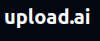
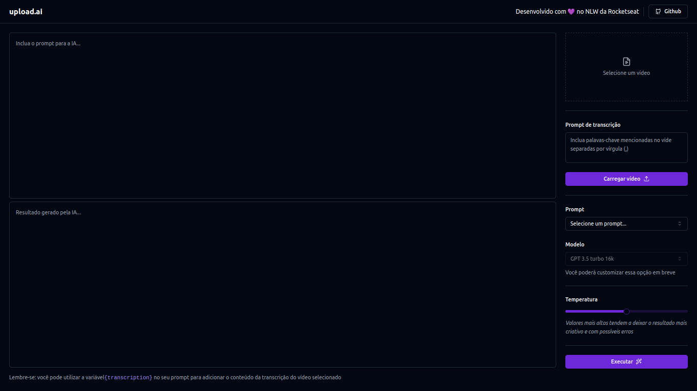

<div align="center">
    
</div>

---
## :books: Descrição

<p>
    Projeto feito durante a NLW IA, utilizando uma Inteligência Artificial (IA), para com base em um vídeo enviado, gerar um resultado de acordo com o modelo pré-cadastrado no prompt ou descrito no seu campo de texto, podendo ser controlado de acordo com as opções escolhidas pelo usuário.
</p>

---
## :art: Layout



---
## :gear: Techs
- Front-end
    - [ReactJS](https://reactjs.org/)
    - [Vite](https://vitejs.dev/)
    - [Axios](https://axios-http.com)
    - [Tailwind](https://tailwindcss.com/)
    <br>    
- Back-end
    - [Fastify](https://fastify.dev/)
    - [Zod](https://zod.dev/)
    - [OpenAI](https://www.npmjs.com/package/openai)
    - [Prisma](https://www.prisma.io/)

---
## :desktop_computer: Como usar
- É necessário a criação de uma API KEY da OpenAI, para utilizar a IA
```
    OPENAPI_KEY=
```
- Após isso é necessário rodar no terminal o comando abaixo, na pasta do backend e frontend:
```
    npm run dev
```
- Para acessar a página web, abra uma aba no navegador e digite localhost:5173
---
## :spiral_notepad: License
Arquivos sob a licença [MIT](https://github.com/lucasgomesgp) criado por Lucas Gomes.